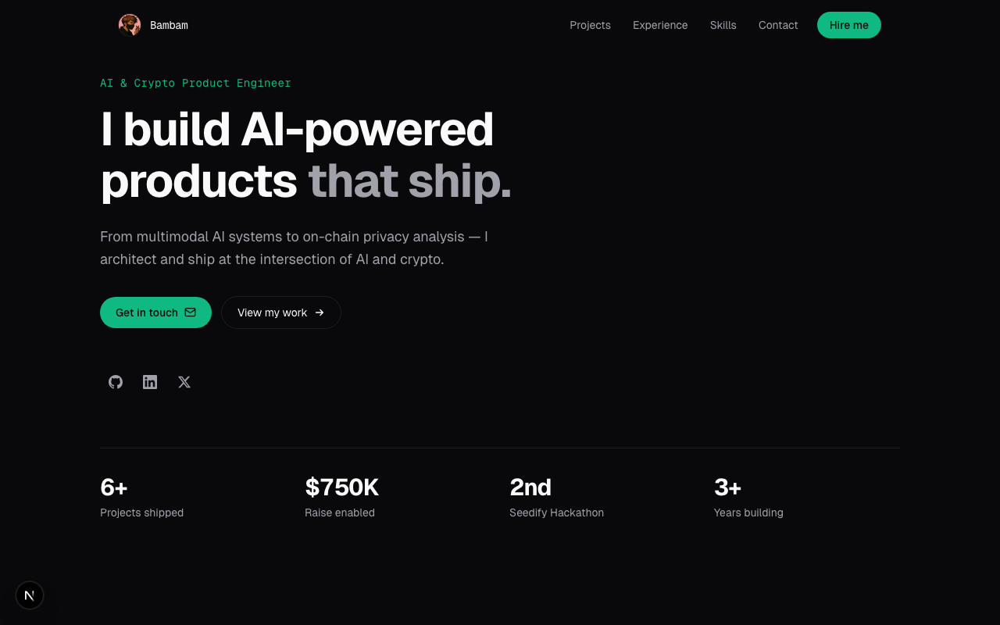
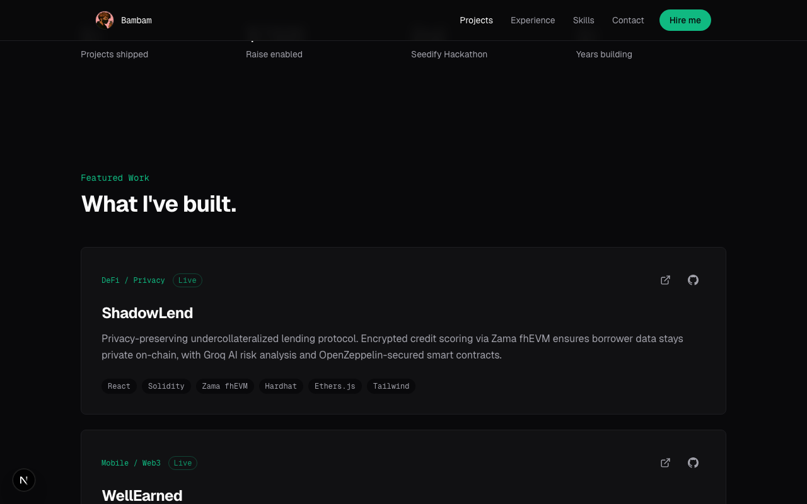

# Bambam: AI & Crypto Product Engineer Portfolio

Personal portfolio site showcasing projects at the intersection of AI and crypto.

[](https://www.typescriptlang.org/)
[](https://nextjs.org/)
[](LICENSE)



## Live Demo

**[ajanaku1.github.io/bambam](https://ajanaku1.github.io/bambam)**

---

## What Is This?

A developer portfolio for Bambam (Dami Mustapha), an AI and crypto product engineer. The site highlights five featured projects spanning DeFi, mobile Web3, and AI engineering, along with experience, skills, and contact info.

---

## Screenshots

| Hero | Projects |
|------|----------|
|  |  |

---

## Features

- **Scroll-triggered animations** with Framer Motion for a polished, modern feel
- **Five featured projects** with live demo links, GitHub links, and tech stacks
- **Responsive layout** optimized for mobile through desktop
- **Dark theme** with a minimal, monospaced design system
- **SEO-ready** with Open Graph tags, structured data, and sitemap
- **Static export** for GitHub Pages and Vercel deployment

---

## Tech Stack

| Layer | Technology |
|-------|-----------|
| Framework | Next.js 16 |
| Language | TypeScript |
| Styling | Tailwind CSS 4 |
| Animations | Framer Motion |
| Fonts | Geist Sans + Geist Mono |
| Deployment | GitHub Pages, Vercel |

---

## Running Locally

```bash
git clone https://github.com/ajanaku1/bambam.git
cd bambam
npm install
npm run dev
```

Open [http://localhost:3000](http://localhost:3000) in your browser.

---

## Project Structure

```
src/
  app/
    page.tsx          # Main page composing all sections
    layout.tsx        # Root layout with metadata and SEO
    globals.css       # Design tokens and global styles
  components/
    Navigation.tsx    # Fixed top nav with section links
    Hero.tsx          # Landing section with stats
    Projects.tsx      # Featured project cards
    Experience.tsx    # Work experience timeline
    Skills.tsx        # Skill groups grid
    Contact.tsx       # Contact form / links
    Icons.tsx         # SVG icon components
public/
  pfp.png            # Profile photo
  sitemap.xml        # SEO sitemap
  robots.txt         # Crawler config
docs/images/         # Screenshots for README
```

---

## License

MIT
