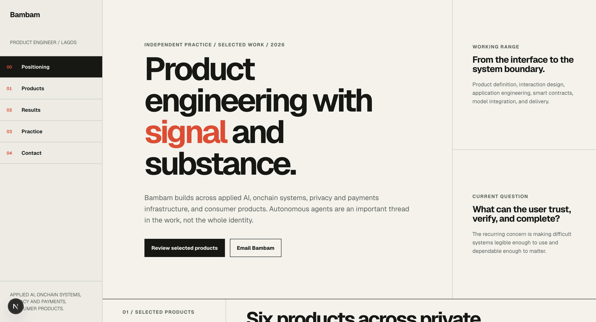

# Bambam: Product Engineer Portfolio

Selected products across applied AI, onchain systems, privacy, payments, and
consumer software.

[](https://www.typescriptlang.org/)
[](https://nextjs.org/)
[](LICENSE)



## Live Demo

**[ajanaku1.github.io/bambam](https://ajanaku1.github.io/bambam)**

The live site contains the selected product register, recorded results, working
practice, and contact links.

---

## What Is This?

This is Bambam's product engineering portfolio. It presents work across applied
AI, onchain systems, privacy and payments infrastructure, and consumer
products. Autonomous agents are one recurring focus within a broader practice.

The interface follows the Signal & Substance direction: an editorial product
register with a neutral palette, vermilion signal color, asymmetric layouts,
and finite motion.

---

## Selected Work

| Product | Focus | Result |
|---------|-------|--------|
| [Zalary](https://github.com/ajanaku1/Zalary) | Confidential payroll on Solana | Private amounts with usable cash-out paths |
| [ShadowLend](https://github.com/ajanaku1/ShadowLend) | Privacy-preserving undercollateralized lending | Encrypted onchain credit decisions |
| [Punt](https://github.com/ajanaku1/punt) | Peer football settlement with on-device AI | Top 4 finalist, Tether Developers Cup |
| [Hanami](https://github.com/ajanaku1/hanami) | Attested AI decisions for NFT access | Round of 32, 0G Zero Cup |
| [InferMart](https://github.com/ajanaku1/InferMart) | Peer market for spare inference capacity | Top 100, QVAC Hackathon |
| [Headhunter](https://github.com/ajanaku1/headhunter) | Autonomous bounty workflow with x402 settlement | Hackathon winner |

---

## Features

- **Indexed navigation** keeps positioning, products, results, practice, and
  contact within reach.
- **Active-section tracking** updates the index as the reader moves through the
  page.
- **Product register** connects each product to its repository, live demo,
  technical focus, and recorded result.
- **Responsive layouts** support mobile, tablet, and desktop without horizontal
  overflow.
- **Accessible interaction** includes keyboard navigation, visible focus
  states, skip navigation, and 44px touch targets.
- **Reduced-motion support** removes entrance motion, smooth scrolling, and
  interaction transitions when requested.
- **Static export** produces a GitHub Pages-compatible site.
- **SEO metadata** includes a canonical URL, Open Graph data, structured data,
  sitemap, and robots file.

---

## Tech Stack

| Layer | Technology |
|-------|------------|
| Framework | Next.js 16 |
| UI | React 19 |
| Language | TypeScript 5 |
| Styling | Plain CSS with design tokens |
| Fonts | Geist Sans and Geist Mono |
| Deployment | GitHub Pages with GitHub Actions |

---

## Quality Gates

The repository includes a source contract for required projects, results,
metadata, motion constraints, and layout structure.

```bash
npm run lint
node scripts/verify-portfolio.mjs
npm run build
```

The interface is also checked at desktop and mobile widths for overflow,
keyboard focus, touch targets, and reduced-motion behavior.

---

## Running Locally

```bash
git clone https://github.com/ajanaku1/bambam.git
cd bambam
npm install
npm run dev
```

Open [http://localhost:3000](http://localhost:3000) in a browser.

To create the GitHub Pages export locally:

```bash
GITHUB_PAGES=true npm run build
```

The generated site is written to `out/` with the `/bambam` base path.

---

## Project Structure

```text
src/
  app/
    page.tsx                 Page composition
    layout.tsx               Metadata and structured data
    globals.css              Design tokens and responsive styles
  components/
    SideIndex.tsx            Indexed navigation and section tracking
    Positioning.tsx          Product engineering introduction
    ProductRegister.tsx      Selected product entries
    ResultsLedger.tsx        Recorded competition outcomes
    PracticeSection.tsx      Broader engineering practice
    ContactPanel.tsx         Contact links
  data/
    portfolio.ts             Product, result, and contact content
scripts/
  verify-portfolio.mjs       Source contract
.github/workflows/
  deploy-pages.yml           GitHub Pages deployment
```

---

## License

MIT
